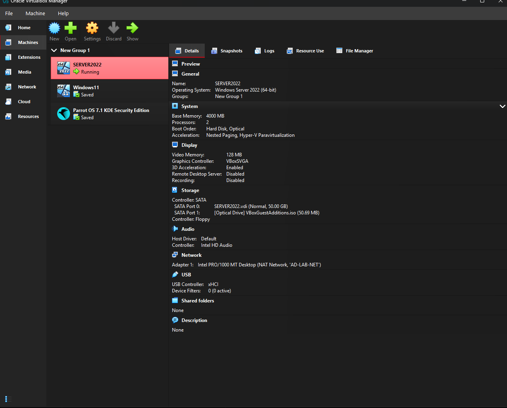
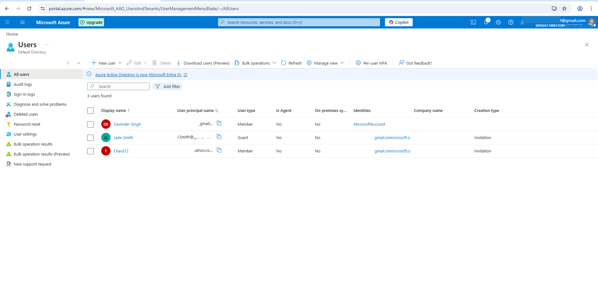
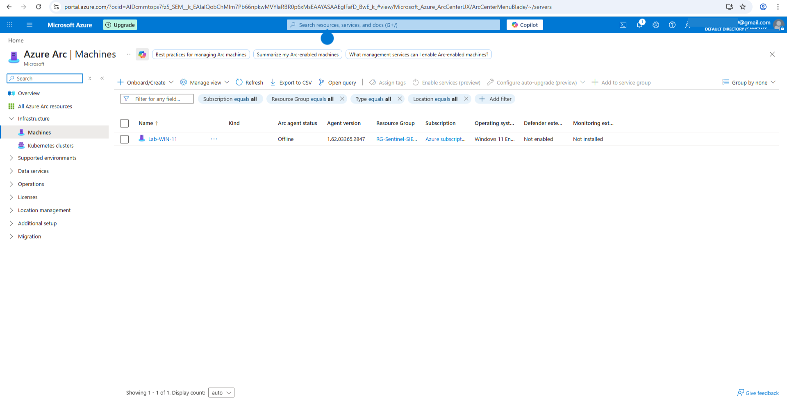
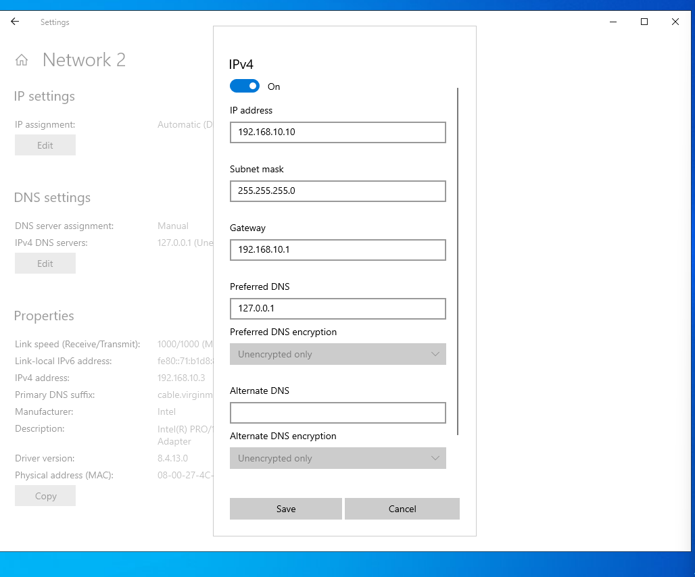
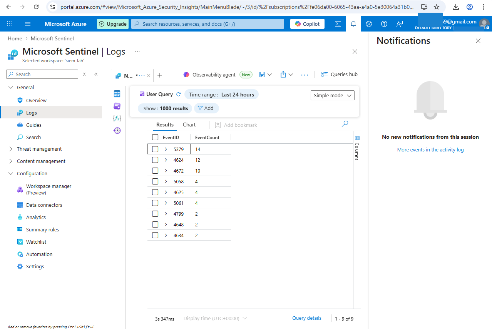
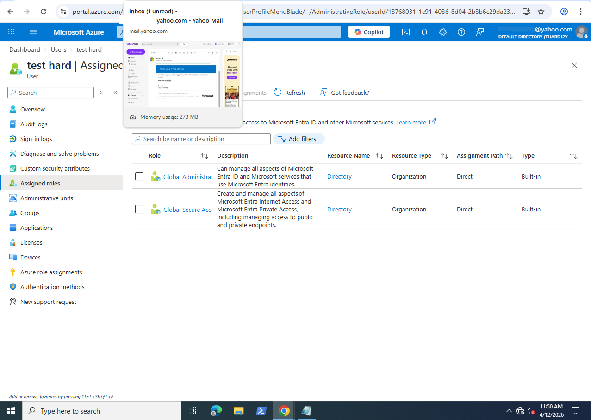
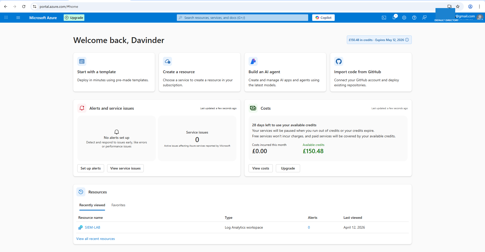

# Azure-Sentinel-SOC-Lab
A hybrid cloud SIEM lab connecting on-premises VMs to Microsoft Sentinel via Azure Arc.
# Hybrid SIEM Engineering & Implementation Project
**Platform: **Microsoft Sentinel
**Environment: **Hybrid (On-Prem VirtualBox + Microsoft Azure)

---

## 1. Executive Summary
This project involved the design and implementation of a hybrid Security Operations Center (SOC) environment, integrating on-premises systems with a cloud-native SIEM. The objective was to build a functional and realistic monitoring pipeline capable of ingesting, analysing, and detecting security events across distributed infrastructure.
By leveraging Microsoft Sentinel and Azure Arc, I established centralized visibility over locally hosted virtual machines, enabling real-time log collection and detection of authentication-based attack activity. The project goes beyond setup by validating telemetry through simulated attacks and developing queries aligned with SOC-level monitoring use cases.

## 2. Architecture Overview
The solution follows a hybrid monitoring model where on-premises systems are extended into the cloud control plane.
* **Cloud Layer:* **
	• Microsoft Entra ID (identity and access management)
	• Azure Resource Groups (resource organisation and governance)
	• Log Analytics Workspace (central log repository)
	• Microsoft Sentinel (SIEM and detection engine)
* **Bridge Layer:* **
	• Azure Arc used to onboard non-Azure machines securely over HTTPS (port 443)
* **Endpoint Layer:* **
	• VirtualBox-hosted Windows Server 2022 (Domain Controller)
	• Windows 11 (client workstation used for attack simulation and telemetry validation)
This architecture reflects a real-world enterprise approach where hybrid environments are monitored through a unified SIEM.
Figure 1: On-premises virtualization environment in Oracle VirtualBox, featuring a Windows Server 2022 Domain Controller and a Windows 11 target workstation. 

## 3. Implementation Approach
* **Phase 1: Identity and Cloud Foundation* **
Configured Azure identity and governance to support SIEM deployment. This included establishing administrative access, organising resources into a dedicated group, and deploying a Log Analytics Workspace to act as the central data store for security logs.
Figure 2: Configuring Entra ID (formerly Azure AD) users and role-based access control (RBAC) to manage security operations within the Azure tenant. 

* **Phase 2: Hybrid Connectivity via Azure Arc* **
Onboarded the Windows 11 virtual machine into Azure using Azure Arc, enabling it to be managed as a native cloud resource.
The onboarding process required secure script execution and validation of connectivity between local infrastructure and Azure services. Once connected, the machine became available for monitoring and agent deployment.
Figure 3: Successful integration of the local Windows 11 host into the Azure control plane via Azure Arc, allowing for centralized management and monitoring. 
### Local Network Configuration
Figure 4: Configuring static IPv4 settings on the local virtual network to ensure consistent communication between the Domain Controller and the endpoint. 

* **Phase 3: Log Ingestion and Detection Setup* **
Deployed the Azure Monitor Agent and configured Data Collection Rules (DCRs) to ingest Windows Security Events into the SIEM.
Focused on high-value authentication logs:
	• Event ID 4625 – Failed logon attempts
	• Event ID 4624 – Successful logons
To validate the pipeline, I simulated a brute-force login attempt against the Windows 11 machine and confirmed that logs were ingested and queryable in near real time.
Figure 5: Real-time telemetry ingestion in Microsoft Sentinel. The table summarizes high-fidelity Security Events (EventIDs 4624, 4625) captured from the Arc-enabled endpoint. 

* **Phase 4: Detection and Query Development* **
Developed KQL queries to identify suspicious authentication patterns and support SOC-style monitoring.
Example detection logic for brute-force activity:
```kusto
SecurityEvent
| where EventID == 4625
| summarize FailedAttempts = count() by TargetAccount, bin(TimeGenerated, 5m)
| where FailedAttempts > 4
| order by FailedAttempts desc
```
This allows identification of accounts experiencing repeated failed login attempts within a short timeframe, a common indicator of password-based attacks.
Additionally, correlation between failed and successful logins was used to simulate detection of potential account compromise scenarios.


## 4. Technical Skills Demonstrated
	• SIEM configuration and log ingestion using Microsoft Sentinel
	• KQL query development for threat detection and investigation
	• Hybrid infrastructure integration using Azure Arc
	• Azure resource management and governance (Resource Groups, IAM)
	• Windows security event analysis and authentication monitoring
	• PowerShell usage for system configuration and script execution

## 5. Technical Challenges and Problem-Solving
A key part of this project was working through real deployment and configuration issues, which required troubleshooting rather than following a fixed guide.
Identity and Access Issues:
Initial setup used an external account type with limited permissions. I identified the restriction and corrected role assignments to ensure full administrative control, enabling proper resource deployment and SIEM configuration.
Script Execution Restrictions:
The onboarding script for Azure Arc was blocked by default PowerShell execution policies. I resolved this by applying a temporary process-level bypass, allowing the script to run without weakening long-term system security.
Resource Deployment Constraints:
During onboarding, the deployment failed due to Azure naming restrictions. I diagnosed the issue and resolved it by explicitly defining a compliant resource name, ensuring successful registration of the machine.
Telemetry Validation:
Rather than assuming successful setup, I actively validated the data pipeline by generating authentication events and confirming ingestion, query visibility, and detection capability within the SIEM.
These challenges improved my understanding of how cloud constraints, endpoint security controls, and identity configurations interact in a real environment.
 

## 6. Key Outcomes
	• Built a functional hybrid SOC lab integrating on-prem and cloud systems
	• Established centralized log ingestion and monitoring pipeline
	• Developed detection logic for brute-force authentication attempts
	• Validated SIEM effectiveness through simulated attack scenarios
	• Gained practical experience troubleshooting real-world cloud and endpoint issues

Figure 6: Azure Portal dashboard overview, showing active monitoring resources and the SIEM-LAB Log Analytics Workspace status. 

## 7. Conclusion
This project demonstrates the ability to design, implement, and validate a hybrid SIEM solution using modern cloud security tools. More importantly, it reflects an understanding of how to move beyond setup into detection, validation, and troubleshooting—skills directly applicable to SOC analyst and entry-level cybersecurity roles.

